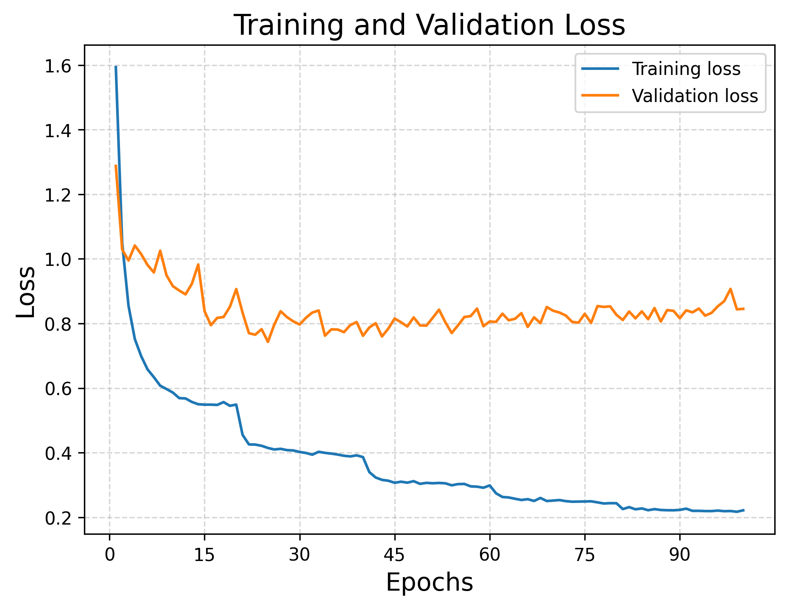
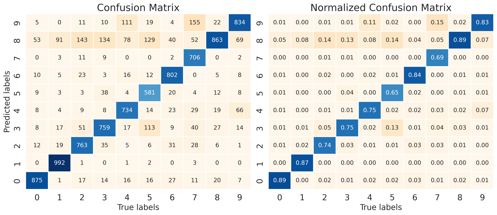

# BasicNN

 


This repository contains an educational implementation of a neural network written from scratch in C++ with minimal dependencies.

The project is intended for learning purposes, focusing on:
- Core neural network building blocks, only fully connected layers are available
- Forward and backward propagation
- Training loops
- Performance-aware C++23 design

## Results

### Training Loss over Epochs


This plot shows the loss progression of the neural network on the training dataset across epochs.

### Confusion Matrix on Test Set


The confusion matrix summarizes the model's performance on the test set, showing correct and misclassified samples for each digit class.

## Features
- Pure C++23 implementation
- Python 3.12 script for visualization and performance
- No external ML frameworks

## Dataset

This project uses the MNIST dataset for testing and benchmarking.

The dataset is **not included** in the repository.

You can download it from: 
[MNIST dataset](https://web.archive.org/web/20200623002706/http://yann.lecun.com/exdb/mnist/)

After downloading, place the files in: `dataset/`  

The code assumes the standard IDX file format.

## Requirements

- C++23 compatible compiler (g++, clang++)
- CMake 3.10+
- Python 3.12

## Build

```bash
mkdir build
cd build
cmake ..
make
```

## Usage

Run the main executable:  
`.build/apps/main`  

## Disclaimer

This is an educational project and is not intended to replace
production-grade ML frameworks.

## License

This project is licensed under the MIT License. See `LICENSE` for details.